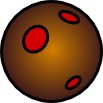

.. _tutorial4:

mMOSS Tutorial 4: Fancy Asteroids
=================================

In :ref:`tutorial3` you learned how to create your own ship image and
replace the ugly default ship image. In this tutorial you will do the
same thing with the asteroids. Unlike the ships, asteroids will come in
many different sizes so we will have to scale the image to match the
asteroids that the game server creates.

Create Your Own Asteroid Image
------------------------------

Use Inkscape (or an equivalent application) to create a round image or
an asteroid that is approximately 100 pixels across. As an alternative,
find a public domain asteroid image in the Internet, scale it to the
correct size and make the background transparent.

This is an example asteroid created in Inkscape:

And the Inkscape :download:`svg file <tutorial4-img.svg>` used to create it.

Load the Image File
-------------------

Find the __init__ method of the Asteroid class. This method initializes
the Asteroid objects before they are used and displayed. The server
sends messages to the client telling the client *where* the asteroids
are and how *big* they are, but the client is solely responsible for
deciding how they should be displayed.

In the __init__ method, add the following code (at the end): ::

    self.image = pygame.image.load("mmossfiles/tutorial4-img.png")
    imagesize = array(self.image.get_size())
    scalefactor = self.radius/100.0 # 100 pixels asteroid image
    self.image = pygame.transform.scale(
        self.image, [int(x*scalefactor) for x in imagesize])
    self.rect = self.image.get_rect()

The first new line loads the image file for the asteroid. You should use
whatever name you have chosen for your asteroid.

The next line figures out how big the image is (width and height, in pixels).
This is stored as a *tuple*, which is a list of two numbers.

The third line figures out how much bigger or smaller the image should be
made, depending on the radius of the asteroid (which is set by the server).
Notice that the asteroid *radius* variable will be 1/2 the diameter of the
asteroid image!

The fourth line uses pygame to scale the image to the appropriate size,
using the scale factor. The short piece of code that says
`[int(x*scalefactor) for x in imagesize]` makes a new list of integers
from the imagesize tuple, multiplying each by scalefactor and turning
them into integers (which is what pygame would like). If you want to
understand how that works, try looking up "python list comprehension" on
the Internets.

The final line gets a rectangle object from the scaled image. The rectangle
will be moved around to draw the asteroid.

Draw the Asteroid Image
-----------------------

Locate the displaySingleObject method in the Asteroid class. Remove the
two lines in the method that draw a circle and a line and replace them
with the following: ::

    rdegrees = round(math.degrees(r)) % 360
    rotatedimage = pygame.transform.rotate(self.image, rdegrees)
    asteroidrect = self.rect.move(
        x-rotatedimage.get_width()/2, y-rotatedimage.get_height()/2)
    dirtyrect = screen.blit(rotatedimage, asteroidrect)

You might notice that this code looks almost exactly like the code we
wrote for rotating and drawing the ship image, with the exception that
rotated copies of the image aren't stored for later. The caching
code could easily be added if necessary (we'll leave it out for now
to keep it simple).

